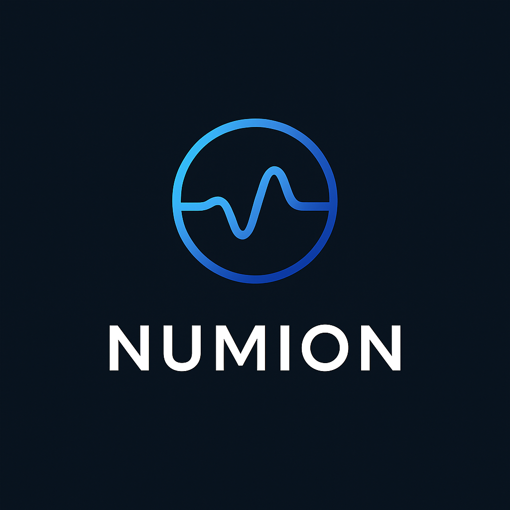

  

# 🧠 NUMION – Collective Intelligence Powered by AI

**Numion** is an open source platform designed to overcome the limitations of traditional collaboration and knowledge management tools. Seamlessly integrating with modern work environments, Numion builds a dynamic neural network that connects people, projects, skills, and ideas.

---

## 🚀 Key Features

- 🔍 **Real-time context analysis** from emails, chats, docs, and code
- 🧭 **Dynamic knowledge graph** of your organization
- 🤖 **Smart suggestions**: relevant teammates, content, or projects
- 📝 **Automatic summaries** of meetings and discussions
- 📊 **Silo prediction and prevention** via pattern recognition

---

## 🔧 Technologies Used

- Python / FastAPI
- LangChain / LLMs
- Neo4j (knowledge graph)
- PostgreSQL / Firebase
- Webhooks, Slack API, GitHub integration
- Docker (containerization)

---

## 🧑‍💻 How to Contribute

1. Fork this repository
2. Create your branch: `git checkout -b feature/my-feature`
3. Commit your changes: `git commit -m 'Add new feature'`
4. Push to your branch: `git push origin feature/my-feature`
5. Open a Pull Request

Please read the [`CONTRIBUTING.md`](./CONTRIBUTING.md) for more details.

---

## 📘 License

This project is licensed under the **MIT License**.

Created by **Antonio Mazzaro**

---

# 🧠 NUMION – Collective Intelligence Powered by AI

**Numion** è una piattaforma open source progettata per superare i limiti della collaborazione e della gestione della conoscenza aziendale. Integrandosi in modo intelligente con i principali strumenti di lavoro, Numion costruisce una rete neurale dinamica che connette persone, progetti, competenze e idee.

---

## 🚀 Caratteristiche principali

- 🔍 **Analisi in tempo reale** di email, chat, documenti e codice
- 🧭 **Mappa neurale della conoscenza** interna all’organizzazione
- 🤖 **Suggerimenti intelligenti**: colleghi, team o contenuti rilevanti per ogni contesto
- 📝 **Sintesi automatica** di meeting e discussioni
- 📊 **Prevenzione dei silos informativi** tramite pattern prediction

---

## 🔧 Tecnologie

- Python / FastAPI
- LangChain / LLM
- Neo4j (grafo della conoscenza)
- PostgreSQL / Firebase
- Webhooks, Slack API, GitHub integration
- Docker (containerizzazione)

---

## 🧑‍💻 Come contribuire

1. Forka il progetto
2. Crea un branch: `git checkout -b feature/il-tuo-feature`
3. Fai il commit: `git commit -m 'Aggiunge nuova funzionalità'`
4. Push: `git push origin feature/il-tuo-feature`
5. Invia una Pull Request

Leggi anche il file [`CONTRIBUTING.md`](./CONTRIBUTING.md) per i dettagli.

---

## 📘 Licenza

Questo progetto è distribuito sotto licenza **MIT**.

Creato da **Antonio Mazzaro**
